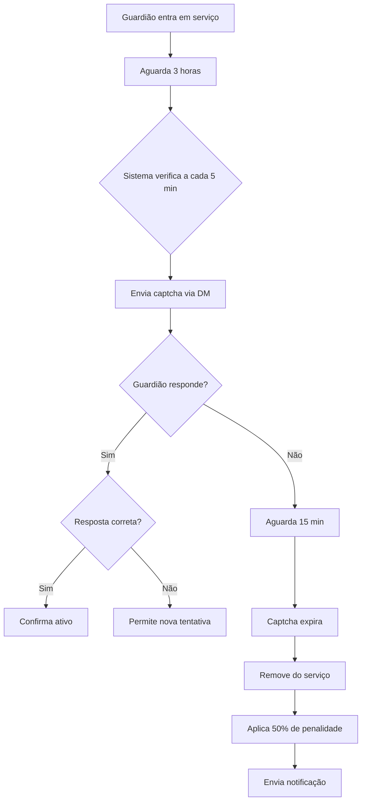

# Sistema de Captcha para Guardiões - Sistema Guardião BETA

## 📋 Visão Geral

O sistema de captcha foi implementado para verificar se guardiões que estão em serviço por mais de 3 horas ainda estão ativos. Isso previne que guardiões fiquem "AFK" em serviço e garante a qualidade do sistema de moderação.

## 🔧 Funcionalidades

### ⏰ Verificação Automática
- **Intervalo**: A cada 5 minutos, o sistema verifica guardiões em serviço
- **Critério**: Guardiões em serviço há mais de 3 horas recebem captcha
- **Canal**: Captcha enviado via DM (mensagem privada)

### 🔐 Tipos de Captcha
1. **Matemático**: Operações simples (ex: 15 + 7 = ?)
2. **Palavra**: Perguntas básicas (ex: Qual é a cor do céu?)
3. **Sequência**: Padrões numéricos/alfabéticos (ex: 2, 4, 6, ?)

### ⏱️ Timeout e Penalidades
- **Tempo limite**: 15 minutos para responder
- **Penalidade**: 50% dos pontos de serviço perdidos
- **Ação**: Remoção automática do serviço
- **Notificação**: DM informando a penalidade

## 🗄️ Estrutura do Banco de Dados

### Tabela: `captchas_guardioes`
```sql
CREATE TABLE captchas_guardioes (
    id SERIAL PRIMARY KEY,
    id_guardiao BIGINT NOT NULL REFERENCES usuarios(id_discord),
    captcha_code VARCHAR(10) NOT NULL,
    captcha_question TEXT NOT NULL,
    captcha_answer VARCHAR(50) NOT NULL,
    status VARCHAR(20) DEFAULT 'Pendente', -- Pendente, Respondido, Expirado
    data_envio TIMESTAMP DEFAULT CURRENT_TIMESTAMP,
    data_resposta TIMESTAMP,
    data_expiracao TIMESTAMP NOT NULL,
    pontos_penalizados INTEGER DEFAULT 0,
    mensagem_id BIGINT, -- ID da mensagem do Discord
    canal_id BIGINT NOT NULL -- ID do canal onde foi enviado
);
```

## 🚀 Como Funciona

### 1. Detecção de Guardiões
```python
# Verifica guardiões em serviço há mais de 3 horas
query = """
    SELECT u.id_discord, u.username, u.ultimo_turno_inicio
    FROM usuarios u
    LEFT JOIN captchas_guardioes c ON u.id_discord = c.id_guardiao 
        AND c.status = 'Pendente' 
        AND c.data_envio > NOW() - INTERVAL '1 hour'
    WHERE u.em_servico = TRUE 
        AND u.categoria IN ('Guardião', 'Moderador', 'Administrador')
        AND u.ultimo_turno_inicio IS NOT NULL
        AND u.ultimo_turno_inicio <= NOW() - INTERVAL '3 hours'
        AND c.id IS NULL
"""
```

### 2. Geração do Captcha
```python
def generate_captcha(self) -> tuple[str, str, str]:
    """Gera um captcha matemático simples"""
    captcha_types = [
        self._generate_math_captcha,
        self._generate_word_captcha,
        self._generate_sequence_captcha
    ]
    
    captcha_type = random.choice(captcha_types)
    return captcha_type()
```

### 3. Envio via DM
```python
async def send_captcha_to_guardian(self, guardian_id: int, channel_id: int) -> bool:
    """Envia captcha para um guardião específico"""
    # Gera captcha
    code, question, answer = self.generate_captcha()
    
    # Salva no banco
    # Envia mensagem com botão
    # Cria view interativa
```

### 4. Processamento de Resposta
```python
async def on_submit(self, interaction: discord.Interaction):
    """Processa a resposta do captcha"""
    user_answer = self.answer.value.strip().lower()
    correct_answer = self.correct_answer.lower()
    
    if user_answer == correct_answer:
        await self._handle_correct_answer(interaction)
    else:
        await self._handle_incorrect_answer(interaction)
```

### 5. Timeout e Penalização
```python
async def _handle_expired_captcha(self, captcha_data: dict):
    """Processa captcha expirado"""
    # Calcula pontos perdidos (50% do que ganharia em 3 horas)
    points_lost = int((3 * 1) * (50 / 100))  # 1.5 pontos
    
    # Remove do serviço e aplica penalidade
    # Envia notificação via DM
    # Edita mensagem original
```

## 📊 Configurações

### Constantes do Sistema
```python
CAPTCHA_TIMEOUT_MINUTES = 15
CAPTCHA_CHECK_INTERVAL_MINUTES = 5
CAPTCHA_SERVICE_HOURS = 3
CAPTCHA_PENALTY_PERCENTAGE = 50
```

### Cálculo de Penalidade
```python
# Pontos perdidos = (horas_serviço * pontos_por_hora) * (percentual_penalidade / 100)
points_lost = int((CAPTCHA_SERVICE_HOURS * TURN_POINTS_PER_HOUR) * (CAPTCHA_PENALTY_PERCENTAGE / 100))
# Exemplo: (3 * 1) * (50 / 100) = 1.5 pontos perdidos
```

## 🔄 Fluxo Completo



## 🛠️ Instalação

### 1. Executar Migração
```bash
python migrate_captcha.py
```

### 2. Reiniciar Bot
```bash
# O sistema será carregado automaticamente
# Cog: cogs.captcha_system
```

### 3. Verificar Logs
```
INFO - Cog cogs.captcha_system carregado com sucesso
INFO - Captcha enviado para guardião 123456789 (ID: 1)
INFO - Captcha expirado processado para guardião 123456789 - 1 pontos perdidos
```

## 📈 Monitoramento

### Logs Importantes
- `Captcha enviado para guardião {id} (ID: {captcha_id})`
- `Captcha expirado processado para guardião {id} - {points} pontos perdidos`
- `Erro ao enviar captcha para guardião {id}: {error}`

### Métricas
- Total de captchas enviados
- Taxa de resposta (respondidos/total)
- Pontos penalizados por inatividade
- Guardiões removidos por timeout

## 🔧 Manutenção

### Limpeza de Dados Antigos
```sql
-- Remove captchas antigos (mais de 7 dias)
DELETE FROM captchas_guardioes 
WHERE data_envio < NOW() - INTERVAL '7 days';
```

### Estatísticas
```sql
-- Captchas por status
SELECT status, COUNT(*) 
FROM captchas_guardioes 
GROUP BY status;

-- Pontos penalizados por mês
SELECT 
    DATE_TRUNC('month', data_envio) as mes,
    SUM(pontos_penalizados) as total_penalizado
FROM captchas_guardioes 
WHERE status = 'Expirado'
GROUP BY mes
ORDER BY mes;
```

## ⚠️ Considerações

### Segurança
- Captchas são gerados aleatoriamente
- Respostas são case-insensitive
- Timeout rigoroso de 15 minutos
- Penalidade significativa (50% dos pontos)

### Performance
- Verificação a cada 5 minutos (não sobrecarrega)
- Índices otimizados no banco
- Limpeza automática de dados antigos

### Experiência do Usuário
- Interface intuitiva com botões
- Feedback imediato
- Notificações claras
- Possibilidade de reentrar em serviço

## 🎯 Benefícios

1. **Qualidade**: Garante que guardiões estejam realmente ativos
2. **Justiça**: Penaliza apenas quem não responde
3. **Transparência**: Sistema automático e objetivo
4. **Eficiência**: Reduz guardiões "fantasma" em serviço
5. **Motivação**: Incentiva participação ativa

## 🔮 Futuras Melhorias

- [ ] Captchas mais complexos (imagens, quebra-cabeças)
- [ ] Sistema de reputação baseado em respostas
- [ ] Notificações proativas antes do timeout
- [ ] Dashboard de estatísticas de captcha
- [ ] Configuração personalizável por servidor
